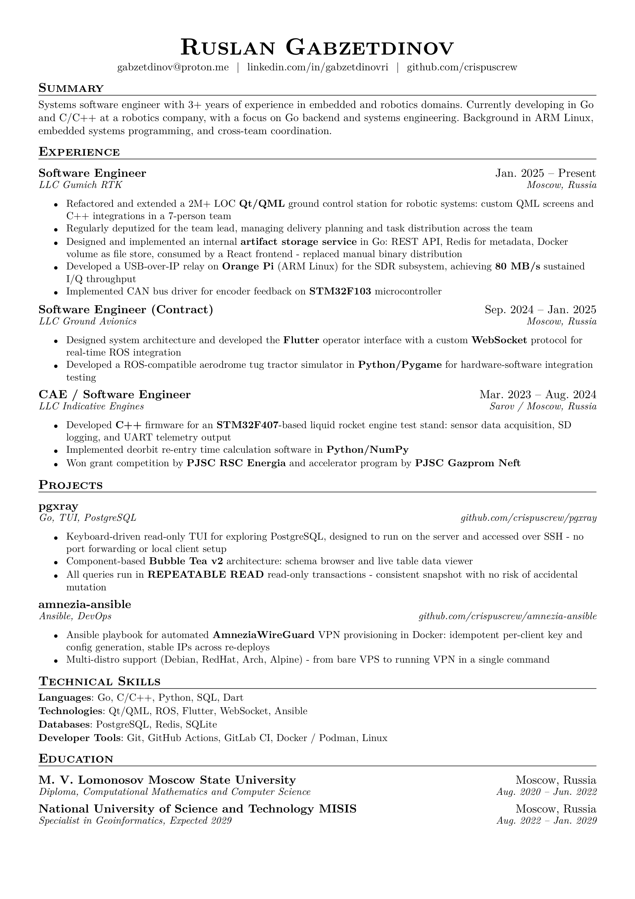

# resumegen

CLI tool that generates many PDF resumes from a single set of TOML data files via [Typst](https://typst.app).

If you have experience in different areas, you may need different resumes - each highlighting what's relevant. This tool automates that.

Inspired by [Jake's Resume](https://www.overleaf.com/latex/templates/jakes-resume/syzfjbzwjncs)



## Quick start

### 1. Install Typst

Download from [typst.app](https://typst.app/docs/installation/) or use your package manager.

### 2. Get resumegen

Go to the [Releases page](https://github.com/crispuscrew/resumegen/releases/latest), download the binary for your platform, and place it somewhere in your `PATH`.

### 3. First run

```sh
resumegen
```

On first launch you will be prompted to copy the default configuration to `~/.config/resumegen/`.

### 4. Fill in your data

```
~/.config/resumegen/data/
├── header.toml     ← name, contacts, summary
├── jobs.toml       ← work experience
├── projects.toml   ← side projects
├── education.toml  ← degrees
└── skills.toml     ← skill categories
```

### 5. Set up a profile

A profile defines which tags to include and in what priority order:

```toml
# ~/.config/resumegen/profiles/go-backend.toml
tags   = ["go", "backend", "devops"]
lang   = "en"
output = "go-backend.pdf"
```

### 6. Generate

```sh
resumegen --profile go-backend
# → ~/.config/resumegen/output/go-backend.pdf
```

## Usage

```sh
resumegen [--profile <name>] [--path <appdir>]
```

| Flag | Default | Description |
|------|---------|-------------|
| `--profile` | `default` | Profile name to use (matches `profiles/<name>.toml`) |
| `--path` | `~/.config/resumegen` | Path to the application directory |

Output PDF is written to `<appdir>/output/<profile.output>`.

## App directory structure

```
~/.config/resumegen/
├── config.toml          # Paths and render settings
├── profiles/            # One .toml per target role
│   ├── default.toml
│   └── cpp-embedded.toml
├── data/                # Resume content
│   ├── header.toml
│   ├── jobs.toml
│   ├── projects.toml
│   ├── education.toml
│   └── skills.toml
└── templates/           # Typst templates (auto-managed)
```

## Profiles

A profile selects and ranks content by tags. Tags are ordered highest to lowest priority - they drive both filtering and trim order when the resume exceeds the page limit.

```toml
# profiles/go-backend.toml
tags   = ["go", "backend", "devops"]
lang   = "en"   # any language key present in your data; always falls back to "en"
output = "go-backend.pdf"
```

Jobs and projects with no matching tags are excluded entirely. Bullets with no matching tags are dropped. If a job ends up with no visible bullets, it is dropped too.

## Data files

Content fields support Typst inline markup: `*bold*`, `_italic_`, `#link("url")[text]`.

### jobs.toml

Job-level `tags` control whether the entire position is shown. Bullet-level `tags` control individual bullet visibility. If a job has no top-level tags, its visibility is determined by its bullets alone.

```toml
[[jobs]]
    tags    = ["go", "backend", "devops"]   # job hidden entirely if none match
    company = "Acme Corp"

    [jobs.title]
    en = "Software Engineer"
    ru = "Инженер-программист"

    [jobs.date]
    en = "Jan. 2025 – Present"

    [jobs.location]
    en = "Moscow, Russia"

    [[jobs.bullets]]
    tags = ["go", "backend"]
    [jobs.bullets.text]
    en = "Built a *REST API* service in Go"
    ru = "Разработал сервис *REST API* на Go"
```

> **Note:** Flat fields like `company` must appear **before** the first `[jobs.*]` subtable in each entry, otherwise TOML will assign them to the wrong table.

### skills.toml

```toml
[[categories]]

    [categories.name]
    en = "Languages"
    ru = "Языки программирования"

    [[categories.items]]
    name = "Go"
    tags = ["go", "backend"]

    [[categories.items]]
    name = "C/C++"
    tags = ["cpp", "embedded"]
```

### education.toml

Education entries are always shown in full - no tag filtering.

```toml
[[edu]]

    [edu.title]
    en = "Moscow State University"

    [edu.degree]
    en = "B.S. Computer Science"

    [edu.location]
    en = "Moscow, Russia"

    [edu.date]
    en = "2020 – 2024"
```

## Page limit and trimming

When a resume exceeds `page_limit`, the tool automatically trims the lowest-scored bullets until the resume fits. Scoring is based on tag priority: bullets matching higher-priority profile tags score higher and are kept longer.

You can tune the behavior in `config.toml`:

```toml
[render]
page_limit     = 1.0      # trim until the resume fits this many pages
page_height_pt = 841.89   # must match the paper size in template.typ (A4 = 841.89, US Letter = 792)

[render.min_elements]
job_bullets     = 1   # a job with fewer included bullets than this is dropped entirely
project_bullets = 1   # same for projects
skill_items     = 1   # a skill category with fewer included items than this is dropped entirely
```

## Build from source

### Requirements

- [Go 1.24+](https://go.dev/dl/)
- [Podman](https://podman.io) or [Docker](https://docker.com) (for my make commands)

### Build

```sh
make build
```

Binary is placed at `./bin/resumegen`.

## Development

```sh
make lint     # run golangci-lint
make test     # run tests
make tidy     # go mod tidy
make rebuild  # force rebuild all container images
make clean    # remove build artifacts
```

## Plans

- Automated tests
- Chronological or manual ordering of bullets and entries
- Verbose mode for debugging filter and trim decisions
- **Self-contained Docker/Podman builder** - run `resumegen` with no local dependencies: Typst bundled inside the container, mount your data directory, get the PDF out

## P.S.

If this project helped u find a job - show your new employer [a resume generated from the defaults](assets/default.pdf) :)