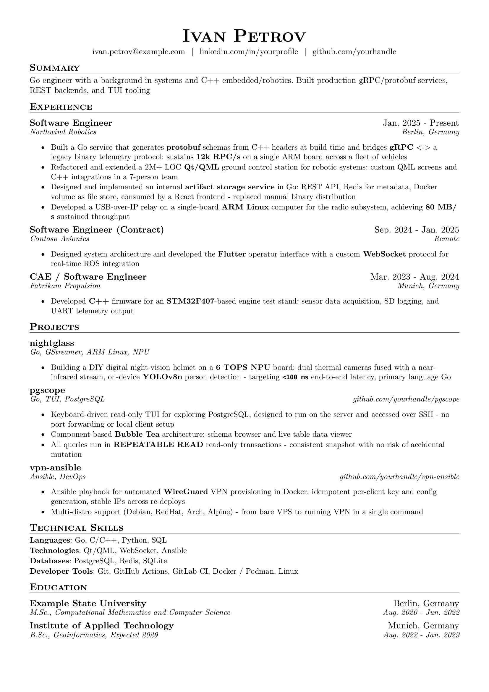

# resumegen

CLI tool that generates many PDF resumes from a single set of TOML data files via [Typst](https://typst.app).

If you have experience in different areas, you may need different resumes - each highlighting what's relevant. This tool automates that.

Inspired by [Jake's Resume](https://www.overleaf.com/latex/templates/jakes-resume/syzfjbzwjncs)



## Quick start

### 1. Install Typst

Download from [typst.app](https://typst.app/docs/installation/) or use your package manager.

### 2. Get resumegen

Go to the [Releases page](https://github.com/crispuscrew/resumegen/releases/latest), download the binary for your platform, and place it somewhere in your `PATH`.

### 3. First run

```sh
resumegen
```

On first launch you will be prompted to copy the default configuration to `~/.config/resumegen/`.
Prefer a self-contained, git-versionable setup? Run `resumegen init` in a directory instead - see
**Workspaces** below.

### 4. Fill in your data

Edit the five TOML files under `~/.config/resumegen/data/`: `header.toml` (name,
contacts, summary), `jobs.toml` (work experience), `projects.toml` (side projects),
`education.toml` (degrees), and `skills.toml` (skill categories).

### 5. Set up a profile

A profile defines which tags to include and in what priority order:

```toml
# ~/.config/resumegen/profiles/go-backend.toml
tags   = ["go", "backend", "devops"]
lang   = "en"
output = "go-backend.pdf"
```

### 6. Generate

```sh
resumegen --profile go-backend
# → ~/.config/resumegen/output/go-backend.pdf
```

## Usage

```sh
resumegen [--profile <name>] [--path <appdir>]
```

| Flag | Default | Description |
|------|---------|-------------|
| `--profile` | `default` | Profile name to use (matches `profiles/<name>.toml`) |
| `--path` | walk-up, then `~/.config/resumegen` | Path to the application directory (see [Workspaces](#workspaces)) |
| `--lang` | from profile | Override the output language |
| `--force` | off | Render even if a bullet has malformed markup or a disallowed URL - the sanitizer falls back to literal text (see [Security & hardening](#security--hardening)) |
| `--version` | - | Print version and exit |

Subcommands - run `resumegen help` for the full list:

| Command | What it does |
|---------|--------------|
| `resumegen render` | Render a profile to PDF (also the default when no command is given) |
| `resumegen init` | Bootstrap a workspace (marker + example data, profiles, templates, config) |
| `resumegen apply …` | Track job applications (see [Application tracker](#application-tracker)) |
| `resumegen prompt …` | Build ready-to-paste LLM prompts (see [Prompt templates](#prompt-templates)) |
| `resumegen tui` | Interactive terminal UI over all of the above (see [Interactive TUI](#interactive-tui)) |
| `resumegen template extract` | Copy a Typst layout template into your appdir for editing |

Output PDF is written to `<appdir>/output/<profile.output>`. The path is resolved
inside the appdir: a relative `profile.output` may step outside `output/` (e.g.
`../drafts/x.pdf`) but never outside the appdir itself - anything that would is
rejected with an error.

## App directory structure

```
~/.config/resumegen/
├── config.toml          # Paths and render settings (all keys optional; defaults apply)
├── profiles/            # One .toml per target role
│   ├── default.toml
│   └── robotics-uav.toml
├── data/                # Resume content
│   ├── header.toml
│   ├── jobs.toml
│   ├── projects.toml
│   ├── education.toml
│   └── skills.toml
├── templates/           # Typst layout templates
├── prompts/             # Prompt templates (extracted on first `prompt` use)
├── applications/        # Job-application tracker entries (see Application tracker)
└── output/              # Rendered PDFs and optional Markdown/TOML dumps
```

## Workspaces

Instead of the single global `~/.config/resumegen/`, you can keep a self-contained,
git-versionable appdir anywhere - useful for tracking your resume data alongside other
projects, or keeping separate sets.

```sh
resumegen init my-resume      # creates my-resume/ with a .resumegen/ marker + example data
cd my-resume
resumegen --profile default   # discovered automatically by walking up from the CWD
```

`init` writes a `.resumegen/` marker that enables **walk-up discovery**: run `resumegen`
from anywhere inside the tree and it finds the workspace. Resolution order is `--path` >
nearest `.resumegen/` marker above the CWD > the default `~/.config/resumegen/`. A workspace
`config.toml` is layered on top of the global one when both exist (workspace wins).

| `init` flag | Effect |
|-------------|--------|
| (default) / `--with-example` | Marker + example data and profiles |
| `--bare` | Marker only; no data |
| `--full-example` | Also extract templates and prompts for editing |
| `--name`, `--description` | Metadata written into the marker |

`init` is idempotent and never overwrites existing files. To override a bundled default
selectively, use `resumegen template extract [name...]` or `resumegen prompt extract <name>` -
these copy the embedded default into your appdir, where it then shadows the built-in.

## Profiles

A profile selects and ranks content by tags. Tags are ordered highest to lowest priority - they drive both filtering and trim order when the resume exceeds the page limit.

```toml
# profiles/go-backend.toml
tags   = ["go", "backend", "devops"]
lang   = "en"   # any language key present in your data; always falls back to "en"
output = "go-backend.pdf"
```

Jobs and projects with no matching tags are excluded entirely. Bullets with no matching tags are dropped. If a job ends up with no visible bullets, it is dropped too.

## Data files

Content fields support Typst inline markup: `*bold*`, `_italic_`, `#link("url")[text]`.

### jobs.toml

Job-level `tags` control whether the entire position is shown. Bullet-level `tags` control individual bullet visibility. If a job has no top-level tags, its visibility is determined by its bullets alone.

```toml
[[jobs]]
    tags    = ["go", "backend", "devops"]   # job hidden entirely if none match
    company = "Acme Corp"

    [jobs.title]
    en = "Software Engineer"
    ru = "Инженер-программист"

    [jobs.date]
    en = "Jan. 2025 - Present"

    [jobs.location]
    en = "Berlin, Germany"

    [[jobs.bullets]]
    tags = ["go", "backend"]
    [jobs.bullets.text]
    en = "Built a *REST API* service in Go"
    ru = "Разработал сервис *REST API* на Go"
```

> **Note:** Flat fields like `company` must appear **before** the first `[jobs.*]` subtable in each entry, otherwise TOML will assign them to the wrong table.

### skills.toml

```toml
[[categories]]

    [categories.name]
    en = "Languages"
    ru = "Языки программирования"

    [[categories.items]]
    name = "Go"
    tags = ["go", "backend"]

    [[categories.items]]
    name = "C/C++"
    tags = ["cpp", "embedded"]
```

### education.toml

Education entries are always shown in full - no tag filtering.

```toml
[[edu]]

    [edu.title]
    en = "Example State University"

    [edu.degree]
    en = "B.S. Computer Science"

    [edu.location]
    en = "Berlin, Germany"

    [edu.date]
    en = "2020 - 2024"
```

## Page limit and trimming

When a resume exceeds `page_limit`, the tool automatically trims the lowest-scored bullets until the resume fits. Scoring is based on tag priority: bullets matching higher-priority profile tags score higher and are kept longer.

You can tune the behavior in `config.toml`:

```toml
[render]
page_limit     = 1.0      # trim until the resume fits this many pages
page_height_pt = 841.89   # must match the paper size in template.typ (A4 = 841.89, US Letter = 792)

[render.min_elements]
job_bullets     = 1   # a job with fewer included bullets than this is dropped entirely
project_bullets = 1   # same for projects
skill_items     = 1   # a skill category with fewer included items than this is dropped entirely
```

## Security & hardening

Files that carry your data are created private by default: tracker entries
(salary, contacts, notes), the `emit_markdown`/`emit_filtered` dumps, prompt
`--output` files, and the generated Typst source are written `0600` (the tracker
directory `0700`). Rendered PDFs stay `0644` - they're the artifact you send out.
Note for SELinux users: the opt-in container render mounts your appdir with a
`:Z` relabel.

resumegen takes a careful stance toward the data it renders and the PDFs it produces.
All of the following except the sanitizer are **opt-in and off by default**, so v1.0
output is unchanged unless you enable them in `[render]`.

### Markup sanitizer (always on)

Content fields are passed through a Typst sanitizer before rendering. Only an allowlist of
inline markup survives (`*bold*`, `_italic_`, raw/code spans, and links) and link URLs are
validated against an allowed-scheme list. A bullet with malformed markup or a disallowed URL
fails the render by default. Pass `--force` to render anyway: the offending content is emitted
as Typst-escaped literal text instead of being interpreted.

### Containerized render - `use_container`

Run Typst inside a throwaway rootless container instead of the host binary. The engine probe
order is podman, then docker, and the container runs locked down:
`--read-only --network=none --cap-drop=ALL --security-opt=no-new-privileges` as your own UID/GID
(plus `--userns=keep-id` on podman).

```toml
[render]
use_container = "auto"   # ""/"false" = host (default) · "true" = require an engine · "auto" = engine if present, else host
```

With `"auto"`, a missing engine or failed image build falls back to the host renderer and prints
a one-line `rendering: host (...)` banner on stderr. Host mode is byte-identical to v1.0.

### PDF metadata stripping - `strip_metadata`

After rendering, rebuild the PDF through `qpdf` to empty its `/Author`, `/Creator`, `/Producer`,
`/CreationDate`, and `/ModDate`. Requires `qpdf` on `PATH`.

```toml
[render]
strip_metadata = true
```

### Strict input validation - `strict_input`

NUL bytes in your data are **always** rejected. Turning on `strict_input` additionally rejects
control characters (except newline and tab), invalid UTF-8, and fields that exceed per-class byte
limits - catching corrupt or hostile data before it reaches the renderer.

```toml
[render]
strict_input = true

[render.limits]      # optional; these are the defaults
short       = 256    # names, titles, dates, company, location, tags
bullet_text = 4096   # bullet text and the header summary
url_or_path = 2048   # contact hrefs and path-like fields
```

## LLM-ready outputs

resumegen can write machine-readable siblings of the PDF so the *exact* resume it
rendered (after tag filtering and page trimming) can be handed to an LLM. Both are
**opt-in and off by default**, and neither changes the PDF.

```toml
[render]
emit_markdown = true   # also write output/<profile>.md
emit_filtered = true   # also write output/<profile>.filtered.toml
```

- `<profile>.md` - the filtered resume as Markdown, grouped by job/project, one bullet
  per line, projected to the profile's language. It carries your authored inline markup
  (`*bold*`, `#link(...)`) as written, so it reads as plain prose.
- `<profile>.filtered.toml` - the post-filter data: only the entities that made it into
  the PDF, with all languages intact. Useful for diffing what a profile actually shows.

Recommended workflow: paste `output/<profile>.md` plus the job description into your own
LLM (Claude, ChatGPT, …) and ask it to tailor your bullets. resumegen never calls an LLM
itself - it only prepares the inputs.

## Prompt templates

resumegen ships a library of prompt templates that turn your resume plus a job
description into a ready-to-paste LLM prompt. It never calls an LLM - it assembles
the text and you paste it into your own Claude/ChatGPT.

```sh
resumegen prompt list                       # what's available
resumegen prompt show tailor-bullets        # the template and the inputs it needs
resumegen prompt run tailor-bullets \
    --jd job.txt --copy                     # fill it in and copy to clipboard
```

A template is a Markdown file with TOML frontmatter (`prompts/<name>.md`). Its
`{{placeholders}}` are filled from declared **input sources**:

| Source | Fills from |
|--------|-----------|
| `data-dump` | `output/<profile>.md` - the v1.2 Markdown dump (enable `emit_markdown` and render first) |
| `jd-file` | a file passed with `--jd <path>` |
| `flag` | a named flag, e.g. `--company`, `--role`, `--tone` |
| `prompt` | asked interactively (skipped under `--no-input`) |
| `stdin` | piped input, e.g. `echo "..." \| resumegen prompt run recruiter-reply` |
| `app-id` | a field of a tracked application, via `--app <id>` (with `field = "jd"` it reads the application's JD file) - see [Application tracker](#application-tracker) |

With `--app <id>`, empty `company`/`role` flag inputs and empty `jd-file` inputs are
filled from the tracked application automatically - so every bundled template works
straight off a tracked application: `resumegen prompt run cover-letter --app <id>`.
Explicit flags always win.

Bundled prompts: `analyze-jd`, `tailor-bullets`, `cover-letter`, `gap-report`,
`interview-prep`, `recruiter-reply`, `salary-research`, `followup`,
`rejection-analysis`. Copy one into your appdir with `resumegen prompt extract
<name>` and edit it - your copy shadows the built-in and is never overwritten.

The bundled set is English, but prompts are just files and language-agnostic:
drop your own `prompts/<name>.md` into your appdir in any language (a copy of the
same name shadows the bundled default; a new name adds to the library). For
localized output you can also keep one template and pass the target language as an
input, e.g. a `--tone` / `lang` flag the body references.

### Output and scripting

`run` writes to stdout by default; `--output <file>` writes a file and `--copy`
sends it to the clipboard (via `wl-copy` or `xclip`), printing only a short
confirmation. For agents and scripts, `--json` makes `list`, `show`, and `run`
emit stable JSON objects, and `--no-input` never blocks on interactive prompts
(an unsatisfied input becomes a named error instead). Exit codes: `0` success,
`1` a resolution error (missing input, no clipboard tool), `2` a usage error.

```sh
resumegen prompt run analyze-jd --jd job.txt --json --no-input
# { "prompt": "analyze-jd", "text": "...", "inputs": {"jd":"jd-file"}, "chars": 696 }
```

## Application tracker

Keep a flat file per job application under `applications/*.toml` - where you
applied, the artifacts you sent, and an append-only event log. It's local, offline,
git-versionable, and never calls an LLM or the network; it only records.

```sh
resumegen apply new --company "Acme" --role "Senior Go Engineer" \
    --profile go-backend --jd jd/acme.md      # create a drafting entry
resumegen apply set <id> status interview     # advance (skipped steps are filled in, each evented)
resumegen apply edit <id> --company "Acme GmbH"   # fix fields later (the id never changes)
resumegen apply followup <id> --action "nudge recruiter"   # --due defaults from config
resumegen apply followup <id> --done 1        # complete a followup (numbers shown by `show`)
resumegen apply contact <id> --name "Ivan" --role recruiter
resumegen apply note <id> "team uses NATS heavily"
resumegen apply list --status screen,interview --stale 14  # query; DUE column shows the next followup
resumegen apply show <id>                      # full detail
resumegen apply reopen <id>                    # bring a closed application back to life
resumegen apply delete <id> --yes              # remove one permanently
```

**Status flow** (each change appends an event; no transition is silent):

```
drafting → applied → screen → interview → offer → accepted
   any active state → withdrawn (you close it)      → rejected (after applying)
```

`ghosted` is applied **automatically** on read when a *submitted* application has
had no activity for `ghost_after_days` (default 30) - there's no daemon, it just
happens the next time you `list`/`show`. Drafts never ghost (you can't be ghosted
on an application you never sent). To close an application yourself, use
`withdrawn`; `ghosted` can't be set by hand. Closed the wrong one? `apply reopen`
brings it back.

A JD is an ordinary text file you keep (e.g. under `jd/`) and point at with
`--jd <path>`; resumegen stores the path, never fetches or parses it. A prompt can
then read it straight from a tracked application: declare an input with
`source = "app-id"`, `field = "jd"` and run `resumegen prompt run analyze-jd --app <id>`.

**Config** (`[tracker]`, both optional):

| Key | Default | Meaning |
|-----|---------|---------|
| `ghost_after_days` | 30 | days of inactivity before an active entry is auto-ghosted on read |
| `followup_default_lag_days` | 7 | due-date offset when `apply followup` omits `--due` |

**Scripting:** `apply list` and `apply show` take `--json` for stable output. Exit
codes match the prompt layer: `0` success, `1` a resolution error (unknown id,
invalid transition, missing followup args), `2` a usage error (bad flag or date).

## Interactive TUI

`resumegen tui` opens an interactive terminal UI over everything above - no new
capability, just a front-end on the same commands. It needs a real terminal (it
refuses to start on a pipe) and, like the rest of the tool, never touches the
network.

```sh
resumegen tui
```

Screens (switch with number keys `1`-`6`):

| # | Screen | What it does |
|---|--------|--------------|
| 1 | Dashboard | counts by status, applications at risk of ghosting, followups due |
| 2 | Applications | list → detail; `n` creates a new application (form; also works on the dashboard), change status, add notes/followups, view the event log. `/` filters, `y` copies the selected id |
| 3 | Generate | pick a profile and render; the render runs in the background and `esc` cancels it mid-flight |
| 4 | Prompts | pick a template, fill its inputs, run it, and `y` to copy the result |
| 5 | Data | open a `data/*.toml` file in `$EDITOR` |
| 6 | Config | read-only view of the effective config and which appdir it came from |

`?` toggles a full keybind overlay; `q` quits. Every action routes through the
same code the CLI uses, so the TUI and CLI never disagree.

`make tui` runs it inside the dev container (no Go needed on the host) with your
appdir mounted. Container caveats: use **rootless podman** (with rootful docker,
files written through the mount become root-owned); the `y` clipboard actions
need `wl-copy`/`xclip`, which the container doesn't have; and editing opens
busybox `vi` regardless of `$EDITOR`. Run the host binary for the full
experience.

**Charm-free builds.** The TUI uses [bubbletea](https://github.com/charmbracelet/bubbletea);
building with `go build -tags notui ./cmd/resumegen` produces a binary that links
none of it (a `single-dependency` build) - `resumegen tui` then simply reports that
support was excluded and every other command works unchanged.

**Config** (`[tui]`, optional):

| Key | Default | Meaning |
|-----|---------|---------|
| `theme` | `default` | color palette; only `default` ships today, and unknown values fall back to it |

## Build from source

### Requirements

- [Go 1.25+](https://go.dev/dl/)
- [Podman](https://podman.io) (rootless, recommended) or [Docker](https://docker.com) (for my make commands)

### Build

```sh
make build
```

Binary is placed at `./bin/resumegen`.

## Development

```sh
make lint     # run golangci-lint
make test     # run tests
make tidy     # go mod tidy
make rebuild  # force rebuild all container images
make clean    # remove build artifacts
```

## Plans

- Transfer from typst to smth embedded in this binary
- Chronological or manual ordering of bullets and entries
- Verbose mode for debugging filter and trim decisions

## License

Licensed under the [Apache License, Version 2.0](LICENSE).

```
Copyright 2026 Gabzetdinov Ruslan

Licensed under the Apache License, Version 2.0 (the "License");
you may not use this file except in compliance with the License.
You may obtain a copy of the License at

    http://www.apache.org/licenses/LICENSE-2.0

Unless required by applicable law or agreed to in writing, software
distributed under the License is distributed on an "AS IS" BASIS,
WITHOUT WARRANTIES OR CONDITIONS OF ANY KIND, either express or implied.
See the License for the specific language governing permissions and
limitations under the License.
```

The resume content under `defaultAppDir/data/` is example data, not part of the
licensed software: replace it with your own.

Third-party Go modules linked into the released binaries are listed with their
full license texts in [THIRD_PARTY_NOTICES.md](THIRD_PARTY_NOTICES.md); all are
MIT or BSD-3-Clause. No fonts and no PDF engine are bundled: Typst is invoked as
a separate program, and the fonts embedded in a rendered PDF come from the Typst
binary (New Computer Modern under the GUST Font License, Libertinus Serif under
the SIL Open Font License 1.1, DejaVu Sans Mono). No font license places
conditions on the resume you generate.

## P.S.

If this project helped u find a job - show your new employer [a resume generated from the defaults](assets/default.pdf) :)