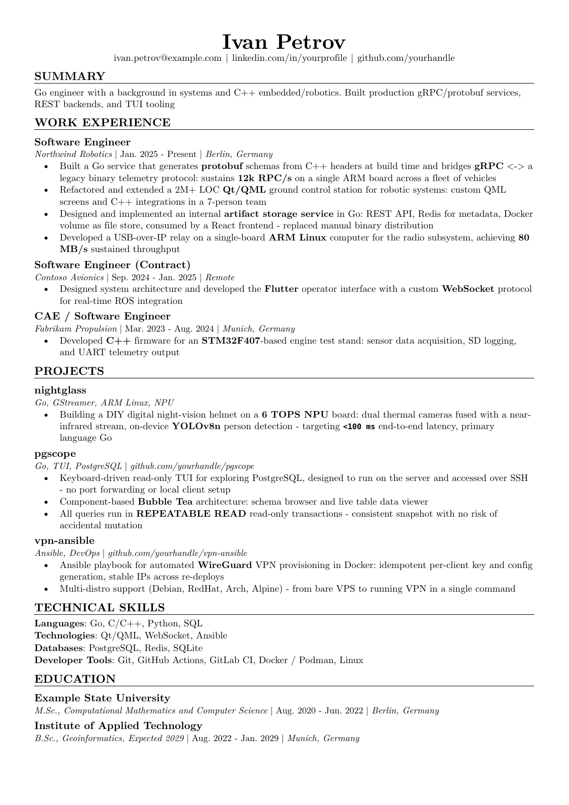

# resumegen

CLI tool that generates many PDF resumes from a single set of TOML data files via
[Typst](https://typst.app). Tag your content once, then let each profile pick the slice that
fits the role. Inspired by [Jake's Resume](https://www.overleaf.com/latex/templates/jakes-resume/syzfjbzwjncs).



## Quick start

Use [Podman](https://podman.io) (rootless, recommended) to run Typst in a container, or
[install Typst](https://typst.app/docs/installation/) to render on the host.

1. **Get the binary** from the [Releases page](https://github.com/crispuscrew/resumegen/releases/latest) and put it on your `PATH`.
2. **Run `resumegen`.** You'll be prompted to copy the defaults to `~/.config/resumegen/`.
   For a self-contained, git-versionable setup, run `resumegen init my-resume` instead.
3. **Fill in your data** under `data/`: `header.toml`, `jobs.toml`, `projects.toml`,
   `education.toml`, `skills.toml`. To bootstrap from a resume you already have, see
   [Importing an existing resume](docs/prompts.md#importing-an-existing-resume).
4. **Write a profile** and generate:

```toml
# profiles/go-backend.toml
tags   = ["go", "backend", "devops"]   # highest priority first
lang   = "en"                        # falls back to "en" for missing translations
output = "go-backend.pdf"
```

```sh
resumegen --profile go-backend   # -> ~/.config/resumegen/output/go-backend.pdf
```

The shipped config uses `use_container = "auto"`: it prefers Podman, then Docker, and
falls back to a host `typst` binary if no engine is available or the image build fails.
The render image is built locally on first use; building it can download its base image
and tools. Later renders reuse it. Set `use_container = "false"` for host-only rendering.

## Usage

```sh
resumegen [--profile <name>] [--path <appdir>]
resumegen help
```

| Command | What it does |
|---------|--------------|
| `render` | Render a profile to PDF (the default command) |
| `init` | Bootstrap a local workspace |
| `apply ...` | Track job applications |
| `prompt ...` | Build ready-to-paste LLM prompts |
| `tui` | Interactive terminal UI |
| `template extract` | Copy a bundled Typst template for editing |

See [CLI flags and workspaces](docs/workspaces.md) for resolution rules, output paths,
and initialization options.

## Workspaces

```sh
resumegen init my-resume
cd my-resume
resumegen --profile default
```

The `.resumegen/` marker enables walk-up discovery. Resolution order is `--path` > nearest
marker above the CWD > `~/.config/resumegen/`. Workspace config layers over global config.
Initialization is idempotent and never overwrites existing files.

## Profiles

A profile selects and ranks content by tags, ordered highest to lowest priority. That order
drives filtering and trim order when the resume exceeds the page limit. Jobs and projects
with no matching tags are excluded, as are bullets with no matching tags. A job left with
no visible bullets is dropped too. Education is always shown.

## Data files

See [Data schema and examples](docs/data.md) for language tables, contact fields, and markup.

## Page limit and trimming

Lowest-scored bullets are trimmed until the page limit is met. See [Render settings](docs/rendering.md).

## Scanner-friendly resumes

The default template uses a single text column, semantic section headings, visible contact
details, and embedded fonts. Tests check PDF text extraction and field order in English
and Russian. See [Scanner compatibility](docs/scanners.md) for checks and updating an existing workspace.

## Security & hardening

The sanitizer is always on. See [Render settings and hardening](docs/rendering.md#security--hardening).

## LLM-ready outputs

Optional Markdown and filtered TOML exports match the final, trimmed resume.
See [LLM-ready outputs](docs/rendering.md#llm-ready-outputs).

## Prompt templates

Ten bundled templates include resume import, bullet tailoring, and interview preparation.
See [Prompt templates](docs/prompts.md). resumegen assembles text; it never calls an LLM.

## Application tracker

Track applications, contacts, notes, events, and followups locally. See [Application tracker](docs/applications.md).

## Interactive TUI

`resumegen tui` provides six screens over the same commands. See [Interactive TUI](docs/applications.md#interactive-tui).

## Build from source

The Makefile runs build tools in containers. See [Development](docs/development.md) for requirements and checks.

```sh
make build     # -> ./bin/resumegen
make lint
make test
make help
```

## Plans

- Replace external Typst rendering with an embedded renderer
- Chronological or manual ordering of bullets and entries
- Verbose mode for debugging filter and trim decisions

## License

Copyright 2026 Gabzetdinov Ruslan. Licensed under the
[Apache License, Version 2.0](LICENSE); you may not use this file except in compliance with it.
Distributed on an "AS IS" BASIS, WITHOUT WARRANTIES OR CONDITIONS OF ANY KIND.

Content in `defaultAppDir/data/` is example data: replace it with your own.
Linked Go module licenses are listed in [THIRD_PARTY_NOTICES.md](THIRD_PARTY_NOTICES.md).
No fonts or PDF engine are bundled in the resumegen binary; Typst is a separate program.
The fonts Typst embeds do not place conditions on the resume you generate.

## P.S.

If this project helped you land a job, I'd like to hear about it - find me at
[github.com/crispuscrew](https://github.com/crispuscrew) :)
